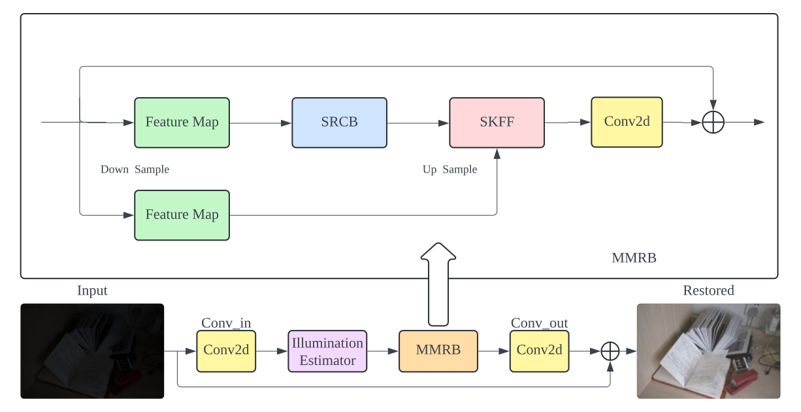

# DARK: Denoising, Amplification, Restoration Kit

[View the Paper](https://github.com/hollinsStuart/dark/blob/master/docs/EECS442_Project_Report.pdf)

The "DARK: Denoising, Amplification Restoration Kit" project introduces an innovative computational framework for enhancing images captured in low-light conditions. The project leverages the principles of Retinex theory combined with advanced image restoration techniques facilitated by convolutional neural networks. By incorporating streamlined architectural elements inspired by MIRNet-v2 and the Retinexformer, the model focuses on efficient, context-sensitive image processing, significantly improving image clarity and color fidelity while maintaining a minimal computational footprint.




## Table of Contents

- [Installation](#installation)
- [Usage](#usage)
- [License](#license)
- [Authors](#authors)
- [Acknowledgments](#acknowledgments)

# Installation

Provide step-by-step series of examples and explanations about how to get a development env running.

This repository is built in PyTorch 1.11 and tested on Ubuntu 16.04 environment (Python3.7, CUDA10.2, cuDNN7.6).
Follow these intructions

## 1. Clone our repository

```shell
git clone git@github.com:hollinsStuart/dark.git
cd dark
```

## 2. Make conda environment

```shell
conda create -n dark python=3.7
conda activate dark
```

## 3. Install dependencies

### Packages

```shell
pip install -r requirements.txt
```

## 4. Install basicsr

```shell
python setup.py develop
```

## 5. Download Dataset:
We use the following datasets:

Lol_train  https://drive.google.com/file/d/1K29vsPfMUsAkYvmNLcaUgiOEYGMxFydd/view?usp=sharing

Lol_test  https://drive.google.com/file/d/1jUGpsih3T-1H7t3gqpEdj7ZD5GcU_v0m/view?usp=sharing

## 6. Modify the configuration file
Please modify the parameters in `Enhancement/Options/dark_train_config.yml`.

# Usage

## 1. Train the model

```shell
python3 basicsr/train.py -opt Enhancement/Options/dark_train_config.yml
```

## 2. Check the image outcome

```shell
python3 basicsr/inference.py 
```

The image outcome is at results/Enhancement_test folder


# License

This project is licensed under the MIT License


# Authors

Zhuoheng Li <zhlii@umich.edu>

Yuheng Pan  <extomato@umich.edu>

Houchen Yu  <hollinsy@umich.edu>

Zhiheng Zhang   <alexzh@umich.edu>


# Acknowledgements

Inspiration from MIRnet_v2 <https://github.com/swz30/MIRNetv2>, Retinexformer <https://github.com/caiyuanhao1998/Retinexformer> and basicSR <https://github.com/XPixelGroup/BasicSR>.

